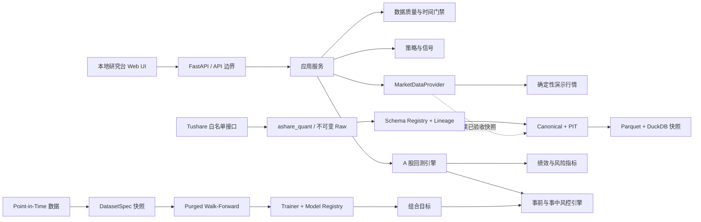

# 系统架构

## 分层原则

- `domain`：不可变领域对象、交易规则与接口协议，不依赖 Web 框架。
- `data`：数据源适配器，只负责把外部数据解析为领域对象。
- `strategies`：纯信号计算，不处理资金、成交和费用。
- `backtest`：订单、成交、持仓、资金和绩效计算，是 A 股约束的唯一事实来源。
- `research`：点时数据质量门禁和模型训练治理，任何研究路径都不得绕过。
- `risk`：限仓、现金、流动性、止损、单日亏损与回撤熔断，独立于策略意图。
- `research/datasets|features|labels|splits|experiments`：机器学习研究产物、时间切分和血缘。
- `ml`：训练器协议、模型产物与治理状态，不直接创建订单。
- `portfolio`：把模型分数转换为目标权重，输出仍需通过风控。
- `services`：组织用户用例，把数据、策略与引擎组合为 API 可用结果。
- `api`：Pydantic 请求/响应模型和路由，负责信任边界。
- `web`：静态单页研究台，只通过 API 访问能力。

真实数据只允许进入新数据库 `ashare_quant`。旧数据库 `tradingagentscn` 不在依赖图内，禁止作为
回填、特征、标签、训练或回测输入。

## 数据与成交约定

- 策略使用复权连续序列时，真实数据适配器必须同时保留可成交原始价；第一版演示数据不存在除权事件。
- 日频信号在收盘后形成，订单最早在下一个交易日开盘成交。
- 未成交订单因停牌或涨跌停顺延；出现反向信号时更新为最新目标仓位。
- 所有收益指标基于扣除费用后的每日权益。
- 风控触发后停止新增风险，在下一可成交开盘退出；退出受阻继续保留订单并记录事件。
- 每次回测响应必须携带规则版本、数据质量证据、风险参数和风险事件。
- 多标的回测由独立组合账户维护每票 acquisition lot、成本、T+1、pending 目标和逐日盯市；旧单标的入口保持兼容。
- 组合目标必须先经过 `PortfolioRiskEngine`，下一开盘由回测层按原始价、手数、容量、涨跌停和停牌生成成交事实。
- 每个训练数据集必须携带冻结的 schema 与 lineage 清单 ID，并能追溯到 Tushare Raw 快照。
