# 机器学习选股系统架构

## 1. 架构原则

本项目采用本地模块化单体。研究阶段使用 Parquet + DuckDB 保存数据，使用内容哈希固定数据集身份，以实验清单和模型注册记录血缘。除非单机资源已经成为可测量瓶颈，不拆分微服务、不引入消息队列。

模型负责产生截面分数，组合构建器负责把分数转换为目标权重，风控引擎拥有最终缩量、拒绝和退出权。模型永远不能直接创建订单。

## 2. 数据与训练流

```mermaid
flowchart LR
    SOURCE["行情 / 财务 / 公告 / 历史成分"] --> RAW["不可变 Raw"]
    RAW --> SCHEMA["Schema Registry"]
    SCHEMA --> QUALITY["DataQualityGuard"]
    QUALITY --> PIT["Point-in-Time Store"]

    PIT --> UNIVERSE["历史股票池"]
    PIT --> FEATURES["特征计算"]
    PIT --> LABELS["标签计算"]

    UNIVERSE --> DATASET["DatasetSpec + Snapshot"]
    FEATURES --> DATASET
    LABELS --> DATASET
    RAW --> LINEAGE["Field-level Lineage"]
    FEATURES --> LINEAGE
    LABELS --> LINEAGE
    LINEAGE --> DATASET

    DATASET --> SPLITS["Purged Walk-Forward"]
    SPLITS --> SERVICE["TrainingService"]
    SERVICE --> APPROVAL["ModelTrainingGuard"]
    APPROVAL --> TRAIN["Trainer"]
    TRAIN --> REGISTRY["DRAFT Model Registry"]

    REGISTRY --> PREDICT["截面预测"]
    PREDICT --> PORTFOLIO["组合构建"]
    PORTFOLIO --> RISK["组合风控"]
    RISK --> BACKTEST["A 股组合回测"]
    BACKTEST --> REPORT["审计报告"]
```



## 3. 时间语义

所有数据行保留：

- `event_time`：事件发生时间。
- `available_at`：当时最早可获得时间。
- `ingested_at`：本系统实际写入时间。

特征只允许读取 `available_at <= decision_time` 的数据。标签独立保存，可引用未来窗口，但不能出现在预测输入或训练折预处理统计之外。

第一版推荐标签：交易日 `t` 收盘决策，`t+1` 开盘进入，`t+21` 开盘退出的 20 日相对基准收益。

## 4. 研究产物身份

### DatasetSpec

数据集 ID 由以下输入的规范 JSON 计算 SHA-256：

- 规则版本
- 跨表 `coverage_report_id` 和 `input_manifest_id`
- 原始数据快照列表
- 合成 schema ID、全部原始 input schema ID 和端到端 lineage 清单 ID
- 已物化 feature artifact ID、feature lineage、label artifact ID 和独立 label lineage
- 历史股票池版本
- 有序特征名称与版本
- 标签名称与版本
- 开始和结束日期

任一输入变化都会生成新的 `ds_*` 标识。

研究 payload 固定为 Parquet，manifest 固定 transform name/version、参数哈希、真实 Git commit、
上游 artifact/snapshot IDs、上游 lineage 和逐输出字段映射。writer 先写同 kind 下的临时目录，
校验 schema、row count 和 SHA-256 后才原子发布到 `<kind>/<artifact_id>/`。feature、label、
universe 和 dataset 各有独立机器 schema；读取时必须同时验证固定路径、kind、manifest 和 payload，
禁止把 label descriptor 重标记为 feature 或从其他目录读取。

历史股票池先按 lifecycle `effective_at` 与 `available_at` 双时钟回放，再应用版本化的上市年龄、
名称/ST 已知性、60 日行情覆盖和 20 日成交额中位数规则。输出同时保留
`eligible_for_new_risk` 与 `must_continue_marking`：退市、ST、低流动性或历史不足只关闭新增风险，
不能让已持仓标的从盯市和退出路径消失。周频决策只取每个完整 ISO 周最后一个开市日，冻结区间
末尾的不完整周不得形成信号。

`DatasetCoverageReport` 先对必需组件的日期区间、accepted 质量、PIT、Raw 快照和 lineage 做
共同覆盖检查。只有 `QUALIFIED` 报告才能生成 `DatasetInputManifest`；input manifest 仍不是
训练数据集，必须等特征和标签分别物化并产生独立 lineage 后才能装配 `DatasetSpec`。

行情因子读取层只允许三类确定性清理：Tushare 成交额/成交量单位归一；物质字段完全一致的自然键
重放折叠；缺失或物理无效值转为带稳定原因的 null。任一 accepted 自然键出现物质冲突时整批停止。
因子层禁止删除样本、填充、去极值、标准化和中性化；这些统计型变换只能在后续训练 fold 内拟合。
滚动窗口必须同时满足观测数量和受治理交易日历连续性，不能用“数量够了”掩盖缺失交易日。

财务因子读取层只允许访问当前 schema 下 accepted 的 PIT 财务指标事件，不允许读取 quarantined
canonical。每个决策点先限制 `available_at <= decision_time`，再选择最新报告期及其当时可见版本；
旧版本保持不可变，修订只影响发布后的决策。输出必须保留 event ID、报告期、公告时钟、update flag、
Raw snapshot 和 Raw row hash。无可见公告或源字段为空时仍保留全部六个因子键并写稳定 null 原因，
不得在因子层填充或删样本。当前 15 个行情因子和 6 个财务因子均已形成独立内容寻址产物。

标签通过独立服务读取未来 Raw 开盘价与执行约束，固定为交易日 `t+1` 进入、`t+21` 退出并减去
`000905.SH` 同期简单收益。停牌、涨停不可买、跌停不可卖或价格缺失只产生稳定 null 原因，不顺延
窗口，也不删除宇宙键。标签行保留四个价格点以及入场/退出约束的 Raw snapshot/row 身份；feature
与 label lineage 有任何交集时 DatasetSpec 装配直接拒绝。首个 21 因子逻辑数据集已经生成；最终测试
封存、purged walk-forward、训练折预处理和受治理 Ridge 训练代码已具备。当前仅用固定合成小数据完成
软件 QA。真实训练 composition root 已固定为 `ashare-research train --factor-report-id ...
--portfolio-backtest-id ...`：先验证 clean worktree、精确因子报告与风险回测，再由
`research/training/` 无损拼接 eligible development universe、候选特征和物理隔离标签，逐折生成预处理
产物、完整训练字段 schema 和字段级 lineage，最后只能经 `TrainingService` 调用 Ridge trainer。
该入口不提供 final holdout 开关，所有产物保持 `DRAFT`；真实 final holdout 仍未打开。

### ExperimentManifest

每次训练至少记录：训练运行 ID、数据集 ID、schema 清单 ID、lineage 清单 ID、规则版本、
Git commit、模型族、特征清单、标签、split 协议、随机种子和最终测试运行次数。

缺少完整字段文档或端到端血缘时，训练不得开始；不能在训练完成后补写清单取得批准。

### ModelRecord

模型初始状态为 `DRAFT`。只有 `ModelTrainingGuard` 返回批准后才能晋级为 `VALIDATED`。被拒绝或退役的模型不能恢复为已验证状态。

## 5. Split 协议

默认使用扩展窗口：

```text
[        train        ][purge][validation][embargo][test]
[             train             ][purge][validation][embargo][test]
```

中期协议固定为初始训练 504、验证 126、内部开发 test 63、滚动 63 个交易日，purge 20、
embargo 5。开发日期不得晚于 `2024-12-31`；`2025-01-01` 起是物理隔离的 final holdout。
`purge` 用于移除标签窗口与验证期重叠的训练样本，`embargo` 用于隔离相邻评估窗口。禁止随机 K 折。

### 5.1 Final holdout 封存

`FinalHoldoutSpec` 绑定 DatasetSpec 和日期边界；`FrozenResearchProtocol` 再固定 split、预处理版本、
代码提交和冻结人/时间。正式打开必须提交匹配该协议且晚于冻结时点的
`FinalHoldoutAccessRequest`。`FinalHoldoutAccessLedger` 通过独占文件创建先登记
`HoldoutAccessRecord`，再返回 holdout；已存在首条记录时第二次访问直接拒绝。开发读取器没有
`allow_final_test` 参数，只能返回 development partition。当前真实账本计数为 0。

### 5.2 Fold-local 预处理 artifact

执行顺序固定为：训练折拟合 1%/99% winsor 边界；每个决策时点做横截面中位数填充并保留
`<feature>_missing`；横截面 z-score；用训练折拟合的固定系数剔除 `log_total_mv` 暴露。
同日横截面统计只使用该决策时点可见的股票，不跨日期；横截面全空时才使用训练折 fallback median。
`log_total_mv` 自身保留标准化值，不做自回归残差化。历史行业 PIT 证据从 2026 年才可用，因此
2020-2025 的行业中性化明确为 `UNAVAILABLE`。

每个 `FoldPreprocessingArtifact` 固定 `dataset_snapshot_id`、fold、变换版本、有序特征、训练起止、
行数、训练帧 SHA-256、winsor/fallback、规模回归系数和行业状态，并保存到
`preprocessor/preprocessor_artifact_<sha256>/manifest.json`。schema 位于
`schemas/fold_preprocessor_artifact_v1.json`；manifest 被修改或跨目录重标记时读取失败。

### 5.3 训练门禁调用链

`TrainingService` 是唯一允许导入 `Trainer` 并创建 `TrainerJob` 的生产入口。调用顺序固定为：先校验
实验声明的 `ModelFamily` 与 trainer 一致，再由 `ModelTrainingGuard` 逐字节验证 DatasetSpec、完整字段
schema、字段级 lineage、每 fold 预处理 manifest、开发帧 SHA-256 和 final holdout 零访问账本，最后才
调用 trainer。任一 descriptor、文件字节、字段顺序、Raw snapshot 血缘或日期边界不一致都 fail closed。

开发审批 scope 固定为 `DEVELOPMENT_TRAINING`，只能产生 `DRAFT` `ModelRecord`，不能复用为
`VALIDATION_PROMOTION`。合成 QA 数据即使证据完整，也不能训练 `INVESTMENT_DECISION` 模型。机器输入
契约见 `schemas/model_training_input_v1.json`。

## 6. 推荐模型演进

1. 等权和线性因子基线。
2. Ridge / Elastic Net，验证数据和训练管线。
3. LightGBM Ranker，处理非线性截面排序。
4. 只有前三类模型稳定后再评估神经网络。

每个复杂模型都必须在相同数据快照、相同 split、相同组合规则和相同成本假设下战胜简单基线。

### 6.1 Ridge 开发基线

第一阶段 trainer 使用 scikit-learn Ridge，候选 alpha 冻结为 `(0.1, 1, 10, 100)`。每个候选只在全部
开发 validation folds 上计算 MSE，并按 `mean_validation_mse, alpha` 稳定选择；内部 development test
只在 alpha 选择完成后评估，final holdout 始终不进入选择、拟合或预测。

同一 fold 同时保存等权因子 validation 基线、选中 Ridge validation/internal-test 指标和内部 test 预测。
产物保存全部候选、训练字段、系数、截距、预处理 ID、因子报告、来源基线回测、实验哈希、预测哈希和
预测 lineage，使用内容寻址 JSON，禁止 pickle。每个预测批次同时持久化精确的
`(decision_time, symbol)` 有序键；组合入口必须重算键哈希，并拒绝缺键、键错位、重复键或跨 fold
重叠。旧的仅哈希预测仍可读取用于审计，但禁止根据当前 frame 顺序猜测键后进入组合。结构见
`schemas/ridge_experiment_artifact_v1.json`。当前合成结果只证明软件行为，不证明 Ridge、因子或策略
具有投资有效性。

## 6.2 因子研究门禁

因子研究位于模型训练之前，唯一编排入口为 `AuditedFactorResearchService`：

```text
factor hypotheses + DatasetSpec/artifacts
             |
             v
append-only TrialBatch (先登记，无结果字段)
             |
             v
development-only diagnostics
             |
             v
BH-FDR q<=0.10 -> direction/coverage gates -> same-family redundancy
             |
             v
complete FactorResearchReport (CANDIDATE + REJECTED)
```

`TrialBatch` 固定全部尝试的 feature artifact、方向、family、`simplicity_rank`、规则版本和 Git commit，
store 在写入和读取时重算 trial/batch ID。服务只有在 diagnostic input 与 ledger trial ID 顺序完全一致时
才开始计算；架构测试禁止其他生产模块直接导入 `diagnose_factor`、`benjamini_hochberg` 或
`select_factor_candidates`。

## 7. 一键研究编排与报告

`ResearchWorkflowService` 只负责编排，不复制任何数据、因子、组合、风控、成交或训练规则。阶段闭集和
顺序固定为 `qualify -> materialize -> diagnose -> portfolio -> backtest -> train`；每个真实适配器返回
不可变 `StageRecord`，首个 `BLOCKED` 后服务停止调用后续阶段。适配器若返回错误 stage identity，整个
运行失败，CLI 没有跳过阶段或允许 final holdout 的参数。

`ashare-research dry-run` 读取真实 Git/uv lock、唯一 DatasetSpec 和完整 trial batch，生成六个
`PLANNED` 阶段的开发期报告。它不连接 Mongo、不读取 Parquet payload、不回测、不训练，模型状态固定
为 `NOT_TRAINED`，因此只证明运行计划和报告完整性。机器契约为
`schemas/research_audit_report_v1.json`。

`ashare-research diagnose` 是真实开发期诊断 composition root。可复现性 preflight 必须先确认工作树
干净，随后只接受 artifact root 中唯一的 DatasetSpec 和 trial batch。`VerifiedArtifactFrameReader`
验证固定物理目录、manifest、SHA-256 与精确行 schema；`ArtifactFactorFrameSource` 共享 universe、label
和规模输入，但按 family 流式逐因子加载，避免把全部因子常驻内存。每个 fold 的预处理只在 train
分区拟合，诊断只拼接互不重叠的 internal-test 行，且硬排除 final holdout。周频 artifact 日期不得
直接解释 504/126/63 等交易日计数；`factor_calendar_runtime` 只读取 DatasetSpec 已固定 schema 和 Raw
snapshot 对应的 accepted SSE 日交易日历，由日历生成 fold 后再映射周频决策行。日历 snapshot 越界、
周频决策日不在日历、缺少 `log_total_mv`、日历不足、trial 与 DatasetSpec artifact identity 不一致或
输入列不完整时均 fail closed。

每份报告披露数据截止、snapshot/schema/lineage、代码和规则身份、股票池规则、21 个因子来源公式、
全部 trial ID、成本/风险版本、最差区间、全部失败、模型状态和 final test 次数。JSON 和中文 Markdown
位于同一内容寻址目录，读取时重新生成 Markdown 比对。nightly 模块通过测试禁止导入研究和训练入口，
每日增量只更新数据。

真实组合目标通过 `ashare-research portfolio --factor-report-id <id>` 显式选择已验证报告，不从多个历史
报告中猜测“最新”。`ArtifactFactorScoreSource` 与诊断数据源物理分离，其输入只有 universe、size 和
candidate feature，没有 label 读取能力；每个候选按预登记方向定向后等权合成，稳定生成逐周 Top 30
和 5% 现金的 `portfolio_targets_*`。该 artifact 是风控前意图，不包含订单、成交或假定当前持仓；真实
回测必须按账户实际成交状态重新调用唯一 `PortfolioRiskEngine`。

Ridge 开发期组合入口为
`ashare-research model-portfolio --model-id <ridge_model_id>`。它只接受 `DRAFT`、`final_test_runs=0`、
研究血缘完整且带精确预测键的模型，逐项核对 DatasetSpec、因子报告、trial batch、训练字段和来源
等权因子基线回测。进入组合构建器的 frame 物理上只能包含 `decision_time`、`symbol`、`model_score`，
不含 label；随后使用相同 Top 30、95% 股票仓位规则生成带 `model_id` 的目标。该步骤不创建订单，目标
仍必须通过正式 `backtest` 入口和唯一 `PortfolioRiskEngine`，final holdout 保持封存。

Ridge 事后诊断入口为
`ashare-research model-diagnose --model-id <ridge_model_id> --portfolio-backtest-id <model_backtest_id>`。
它只读取已持久化的 keyed internal-test prediction、训练时保存的逐 fold 系数、精确等权基线目标/回测
和模型目标/回测，生成内容寻址的 `model_diagnostic_*`。报告披露整体、逐 fold、逐年 Rank IC，系数
均值/标准差/符号一致率，逐期 Top30 重合率，两套成本后回测指标及熔断事件。机器契约为
`schemas/model_diagnostic_report_v1.json`。

该报告固定 `diagnostic_scope=POST_HOC_DEVELOPMENT_ONLY`、`tuning_permitted=false`、`model_status=DRAFT`
和 `final_test_runs=0`。诊断代码禁止重新拟合；任何基于报告的特征、alpha、标签或组合修改都必须成为
新实验，原 internal-test 区间不能再次声称为未见数据。行业 PIT 不可用时仍固定为 `UNAVAILABLE`，
不能用当前行业快照补齐。

由该报告引出的新实验必须先经 `ashare-research model-preregister`。该 composition root 在干净 Git
工作树下重新验证 `model_diagnostic -> ridge model -> DatasetSpec -> model backtest` 身份链，然后将
`model_protocol_*` 追加写入 artifacts。协议固定 rank-label Ridge 假设、训练目标、特征、开发期门槛、
成本/风控版本和 final holdout 单次人工授权；CLI 与 Pydantic 边界都拒绝无时区登记时间。预注册命令不
训练、不拟合、不读取 holdout，产物固定为 `PREREGISTERED_NOT_IMPLEMENTED`。

协议实现入口为 `ashare-research train-ridge-rank --protocol-id <model_protocol_id>`。运行时在读取训练帧
前验证 protocol、父 Ridge、父诊断和父因子基线回测，并在装配训练包后再次核对 DatasetSpec schema、
lineage、特征顺序、label、成本与风控版本。`research/training/targets.py` 按决策日生成 `[0,1]` 平均秩；
预处理仍只在训练折拟合。`RidgeRankTrainer` 与 `RidgeTrainer` 共享线性拟合实现，但以不同
`ModelFamily` 经唯一 `TrainingService -> ModelTrainingGuard` 分发，不能互换。

rank 模型的 validation/internal-test MSE 使用 rank target；预测 artifact 的 `labels` 始终保留原始未来
收益，并显式记录 `raw_forward_return_for_diagnostics`。模型 manifest 绑定 `model_protocol_*` 和
`label_transform=cross_sectional_percentile_rank`；其 `portfolio_rule_version` 保留训练来源的因子基线
规则，protocol 单独冻结后续模型 Top30 规则。状态仍为 `DRAFT`，final holdout 计数仍为零。

真实回测入口为
`ashare-research backtest --portfolio-target-id <portfolio_targets_id>`。composition root 显式读取目标与唯一
DatasetSpec，股票五链和中证 500 基准查询都受 DatasetSpec schema 与 Raw snapshot 白名单约束；目标
股票并集作为 Mongo symbol filter。`build_portfolio_backtest_inputs` 是无 I/O 的装配边界，只产生原始
session、决策日风险快照和逐日对齐基准。`PortfolioBacktestEngine` 内部仍是唯一
`PortfolioRiskEngine` 调用者，使用实际 tax-lot 持仓计算换手；稀疏停牌事件作为 session 证据进入执行，
不得合成 OHLC。内容寻址报告同时固定实际使用快照、成本/风控版本和 `final_test_runs=0`。

每个决策日先做横截面 Spearman Rank IC，再按开发期日序列计算均值、ICIR、方向一致率和均值 IC 的
双侧正态近似 p 值。五分组使用预登记方向后的横截面排序；净 Top-Bottom 收益扣除固定 round-trip
成本与实际 Top 组换手。报告同时保留 coverage、缺失 feature/label、因子自相关、规模暴露、年度、
市场状态和 PIT 行业可得时的行业 IC。行业不可得时保持空分段，不从当前行业快照回填。

同一 batch 的全部 p 值统一执行 BH-FDR；增加噪声 trial 会改变 q 值。通过 FDR、coverage 和方向门禁
的因子才进入同 family 相关性去冗余，按更低 `simplicity_rank` 和稳定 feature name 顺序保留。
Top-Bottom 收益只用于诊断和成本感知，不是单一晋级规则。最终报告必须按原 ledger 顺序同时保留
`CANDIDATE` 和 `REJECTED`，并为拒绝提供稳定原因代码。

## 8. 组合与风控边界

模型产物以 `model_id` 标识；组合边界接收 `symbol`、`decision_time` 和分数并输出带模型身份的目标权重，
随后由风控检查：

- 单票和持仓数量限制
- 行业与风格暴露
- 现金、换手率和成交量参与率
- 流动性、停牌、涨跌停和容量
- 组合波动率、相关性、集中度和最大回撤

只有通过风控后的差异订单才能进入成交模拟。

第一版组合协议固定为：对已准入候选因子的训练折标准化值做等权平均，按复合分数降序、
`symbol` 升序稳定排序，选 Top 30 并分配 95% 股票仓位。组合构建器只输出
`PortfolioTarget`，不能导入 `domain.trading` 或 `backtest`，该边界由架构测试强制。

`PortfolioRiskEngine` 是组合缩量和拒绝的唯一所有者，顺序固定为持仓数、单票、是否允许新增风险、
成交量与一手容量、PIT 行业、现金与 HHI 集中度、换手率。对当前持仓的目标零权重会继续保留，表达
明确退出意图；`eligible_for_new_risk=false` 只禁止增仓，不自动制造卖出。历史 PIT 行业未知时保留
研究目标，生成 `INDUSTRY_EXPOSURE_UNAVAILABLE/BLOCK_VALIDATION`，状态保持 `DRAFT`。
机器契约见 `schemas/portfolio_risk_decision_v1.json`。

组合回测保留原单标的 `BacktestEngine` 兼容入口，新增的 `PortfolioBacktestEngine` 是多标的唯一编排
入口。每个交易日顺序固定为：开盘重试上期目标 -> 先卖后买逐笔结算 -> 收盘按原始价盯市 -> 组合
熔断 -> 接收当日收盘目标 -> `PortfolioRiskEngine` -> 留待下一开盘执行。架构测试禁止第二个组合
风险入口。

账户按标的保存 acquisition tax lots，T+1 只允许卖出前一交易日及更早取得的份额。停牌、涨停买入、
跌停卖出、零一手容量、现金不足和缺行情均生成稳定订单状态；部分成交或未成交目标跨日保留。风险
熔断后不再接收新增目标，退出被阻断时每天生成 `EXIT_BLOCKED/RETRY_EXIT`。费用、滑点和最低现金
缓冲共同参与结算，不能让佣金额外侵蚀 5% 现金底线。

组合报告披露绝对、基准和超额收益、波动率、Sharpe、最大回撤、换手、费用、最大成交量参与率、
pending 订单、风险事件及年度分段；结构见 `schemas/portfolio_backtest_report_v1.json`。

## 9. 实施顺序

1. 真实数据适配器与不可变 Raw 层。
2. Point-in-Time 仓库和历史股票池。
3. 特征、标签和数据集快照物化。
4. 多标的组合回测与组合级风控。
5. Ridge 基线训练器。
6. LightGBM Ranker、实验比较和模型注册 UI。

## 10. 模型工程目录与扩展边界

模型算法是可替换适配器，不拥有数据治理、预处理、组合、风控或成交规则。目录固定为：

```text
research/
  datasets/          # DatasetSpec、资格证据和不可变训练数据引用
  features/          # 与模型无关的 PIT 原始因子
  labels/            # 与特征物理隔离的未来标签
  preprocessing/     # 只在当前训练 fold 拟合的统一预处理
  splits/            # purge、embargo、walk-forward 和最终测试封存
  experiments/       # ModelFamily、ExperimentManifest 和试验账本

ml/
  contracts.py       # Trainer Protocol 和模型产物公共契约
  trainers/          # 具体算法库适配器
    ridge.py         # 第一阶段；只实现 Ridge 的拟合、预测和序列化
    lightgbm_ranker.py # 后续阶段；未满足晋级条件前不得实现或启用
  registry.py        # 与算法无关的 DRAFT/VALIDATED/REJECTED/RETIRED 生命周期

services/
  training.py        # 唯一训练入口；校验模型族并先执行 ModelTrainingGuard

portfolio/           # 模型分数到目标权重，不导入具体训练器
backtest/            # 风控后的订单、成交和账户事实来源
```

硬边界：

- `Trainer` 必须声明一个闭集 `ModelFamily`。实验声明与实现不一致时，训练开始前拒绝。
- `ml/trainers/` 不得导入 `api`、`data`、`services`、`portfolio`、`backtest` 或 `strategies`。
- Ridge 和 LightGBM 必须读取相同的 DatasetSpec、fold 与预处理产物；不得在算法文件中各自清洗数据。
- 新模型只新增一个 trainer adapter 和对应测试，不修改特征、标签、组合、风险或回测规则。
- 具体 trainer 不调用 `ModelTrainingGuard`。所有训练统一由 `TrainingService` 先审批再调用一次。
- LightGBM 只有在相同快照、split、组合、成本和风险参数下稳定胜过 Ridge 后才可申请晋级。
