# 机器学习选股系统架构

## 1. 架构原则

本项目采用本地模块化单体。研究阶段使用 Parquet + DuckDB 保存数据，使用内容哈希固定数据集身份，以实验清单和模型注册记录血缘。除非单机资源已经成为可测量瓶颈，不拆分微服务、不引入消息队列。

模型负责产生截面分数，组合构建器负责把分数转换为目标权重，风控引擎拥有最终缩量、拒绝和退出权。模型永远不能直接创建订单。

## 2. 数据与训练流

```mermaid
flowchart LR
    SOURCE["行情 / 财务 / 公告 / 历史成分"] --> RAW["不可变 Raw"]
    RAW --> SCHEMA["Schema Registry"]
    SCHEMA --> QUALITY["DataQualityGuard"]
    QUALITY --> PIT["Point-in-Time Store"]

    PIT --> UNIVERSE["历史股票池"]
    PIT --> FEATURES["特征计算"]
    PIT --> LABELS["标签计算"]

    UNIVERSE --> DATASET["DatasetSpec + Snapshot"]
    FEATURES --> DATASET
    LABELS --> DATASET
    RAW --> LINEAGE["Field-level Lineage"]
    FEATURES --> LINEAGE
    LABELS --> LINEAGE
    LINEAGE --> DATASET

    DATASET --> SPLITS["Purged Walk-Forward"]
    SPLITS --> TRAIN["Trainer"]
    TRAIN --> APPROVAL["ModelTrainingGuard"]
    APPROVAL --> REGISTRY["Model Registry"]

    REGISTRY --> PREDICT["截面预测"]
    PREDICT --> PORTFOLIO["组合构建"]
    PORTFOLIO --> RISK["组合风控"]
    RISK --> BACKTEST["A 股组合回测"]
    BACKTEST --> REPORT["审计报告"]
```



## 3. 时间语义

所有数据行保留：

- `event_time`：事件发生时间。
- `available_at`：当时最早可获得时间。
- `ingested_at`：本系统实际写入时间。

特征只允许读取 `available_at <= decision_time` 的数据。标签独立保存，可引用未来窗口，但不能出现在预测输入或训练折预处理统计之外。

第一版推荐标签：交易日 `t` 收盘决策，`t+1` 开盘进入，`t+21` 开盘退出的 20 日相对基准收益。

## 4. 研究产物身份

### DatasetSpec

数据集 ID 由以下输入的规范 JSON 计算 SHA-256：

- 规则版本
- 跨表 `coverage_report_id` 和 `input_manifest_id`
- 原始数据快照列表
- 合成 schema ID、全部原始 input schema ID 和端到端 lineage 清单 ID
- 已物化 feature artifact ID、feature lineage、label artifact ID 和独立 label lineage
- 历史股票池版本
- 有序特征名称与版本
- 标签名称与版本
- 开始和结束日期

任一输入变化都会生成新的 `ds_*` 标识。

研究 payload 固定为 Parquet，manifest 固定 transform name/version、参数哈希、真实 Git commit、
上游 artifact/snapshot IDs、上游 lineage 和逐输出字段映射。writer 先写同 kind 下的临时目录，
校验 schema、row count 和 SHA-256 后才原子发布到 `<kind>/<artifact_id>/`。feature、label、
universe 和 dataset 各有独立机器 schema；读取时必须同时验证固定路径、kind、manifest 和 payload，
禁止把 label descriptor 重标记为 feature 或从其他目录读取。

历史股票池先按 lifecycle `effective_at` 与 `available_at` 双时钟回放，再应用版本化的上市年龄、
名称/ST 已知性、60 日行情覆盖和 20 日成交额中位数规则。输出同时保留
`eligible_for_new_risk` 与 `must_continue_marking`：退市、ST、低流动性或历史不足只关闭新增风险，
不能让已持仓标的从盯市和退出路径消失。周频决策只取每个完整 ISO 周最后一个开市日，冻结区间
末尾的不完整周不得形成信号。

`DatasetCoverageReport` 先对必需组件的日期区间、accepted 质量、PIT、Raw 快照和 lineage 做
共同覆盖检查。只有 `QUALIFIED` 报告才能生成 `DatasetInputManifest`；input manifest 仍不是
训练数据集，必须等特征和标签分别物化并产生独立 lineage 后才能装配 `DatasetSpec`。

行情因子读取层只允许三类确定性清理：Tushare 成交额/成交量单位归一；物质字段完全一致的自然键
重放折叠；缺失或物理无效值转为带稳定原因的 null。任一 accepted 自然键出现物质冲突时整批停止。
因子层禁止删除样本、填充、去极值、标准化和中性化；这些统计型变换只能在后续训练 fold 内拟合。
滚动窗口必须同时满足观测数量和受治理交易日历连续性，不能用“数量够了”掩盖缺失交易日。

财务因子读取层只允许访问当前 schema 下 accepted 的 PIT 财务指标事件，不允许读取 quarantined
canonical。每个决策点先限制 `available_at <= decision_time`，再选择最新报告期及其当时可见版本；
旧版本保持不可变，修订只影响发布后的决策。输出必须保留 event ID、报告期、公告时钟、update flag、
Raw snapshot 和 Raw row hash。无可见公告或源字段为空时仍保留全部六个因子键并写稳定 null 原因，
不得在因子层填充或删样本。当前 15 个行情因子和 6 个财务因子均已形成独立内容寻址产物；标签和
`DatasetSpec` 尚未完成，因此训练入口仍必须关闭。

### ExperimentManifest

每次训练至少记录：训练运行 ID、数据集 ID、schema 清单 ID、lineage 清单 ID、规则版本、
Git commit、模型族、特征清单、标签、split 协议、随机种子和最终测试运行次数。

缺少完整字段文档或端到端血缘时，训练不得开始；不能在训练完成后补写清单取得批准。

### ModelRecord

模型初始状态为 `DRAFT`。只有 `ModelTrainingGuard` 返回批准后才能晋级为 `VALIDATED`。被拒绝或退役的模型不能恢复为已验证状态。

## 5. Split 协议

默认使用扩展窗口：

```text
[        train        ][purge][validation][embargo][test]
[             train             ][purge][validation][embargo][test]
```

`purge` 用于移除标签窗口与验证期重叠的训练样本，`embargo` 用于隔离相邻评估窗口。禁止随机 K 折用于金融时间序列。

## 6. 推荐模型演进

1. 等权和线性因子基线。
2. Ridge / Elastic Net，验证数据和训练管线。
3. LightGBM Ranker，处理非线性截面排序。
4. 只有前三类模型稳定后再评估神经网络。

每个复杂模型都必须在相同数据快照、相同 split、相同组合规则和相同成本假设下战胜简单基线。

## 7. 组合与风控边界

模型输出包括 `symbol`、`decision_time`、`model_id`、分数和排名。组合构建器输出目标权重，随后由风控检查：

- 单票和持仓数量限制
- 行业与风格暴露
- 现金、换手率和成交量参与率
- 流动性、停牌、涨跌停和容量
- 组合波动率、相关性、集中度和最大回撤

只有通过风控后的差异订单才能进入成交模拟。

## 8. 实施顺序

1. 真实数据适配器与不可变 Raw 层。
2. Point-in-Time 仓库和历史股票池。
3. 特征、标签和数据集快照物化。
4. 多标的组合回测与组合级风控。
5. Ridge 基线训练器。
6. LightGBM Ranker、实验比较和模型注册 UI。

## 9. 模型工程目录与扩展边界

模型算法是可替换适配器，不拥有数据治理、预处理、组合、风控或成交规则。目录固定为：

```text
research/
  datasets/          # DatasetSpec、资格证据和不可变训练数据引用
  features/          # 与模型无关的 PIT 原始因子
  labels/            # 与特征物理隔离的未来标签
  preprocessing/     # 只在当前训练 fold 拟合的统一预处理
  splits/            # purge、embargo、walk-forward 和最终测试封存
  experiments/       # ModelFamily、ExperimentManifest 和试验账本

ml/
  contracts.py       # Trainer Protocol 和模型产物公共契约
  trainers/          # 具体算法库适配器
    ridge.py         # 第一阶段；只实现 Ridge 的拟合、预测和序列化
    lightgbm_ranker.py # 后续阶段；未满足晋级条件前不得实现或启用
  registry.py        # 与算法无关的 DRAFT/VALIDATED/REJECTED/RETIRED 生命周期

services/
  training.py        # 唯一训练入口；校验模型族并先执行 ModelTrainingGuard

portfolio/           # 模型分数到目标权重，不导入具体训练器
backtest/            # 风控后的订单、成交和账户事实来源
```

硬边界：

- `Trainer` 必须声明一个闭集 `ModelFamily`。实验声明与实现不一致时，训练开始前拒绝。
- `ml/trainers/` 不得导入 `api`、`data`、`services`、`portfolio`、`backtest` 或 `strategies`。
- Ridge 和 LightGBM 必须读取相同的 DatasetSpec、fold 与预处理产物；不得在算法文件中各自清洗数据。
- 新模型只新增一个 trainer adapter 和对应测试，不修改特征、标签、组合、风险或回测规则。
- 具体 trainer 不调用 `ModelTrainingGuard`。所有训练统一由 `TrainingService` 先审批再调用一次。
- LightGBM 只有在相同快照、split、组合、成本和风险参数下稳定胜过 Ridge 后才可申请晋级。
