# 机器学习选股系统架构

## 1. 架构原则

本项目采用本地模块化单体。研究阶段使用 Parquet + DuckDB 保存数据，使用内容哈希固定数据集身份，以实验清单和模型注册记录血缘。除非单机资源已经成为可测量瓶颈，不拆分微服务、不引入消息队列。

模型负责产生截面分数，组合构建器负责把分数转换为目标权重，风控引擎拥有最终缩量、拒绝和退出权。模型永远不能直接创建订单。

## 2. 数据与训练流

```mermaid
flowchart LR
    SOURCE["行情 / 财务 / 公告 / 历史成分"] --> RAW["不可变 Raw"]
    RAW --> SCHEMA["Schema Registry"]
    SCHEMA --> QUALITY["DataQualityGuard"]
    QUALITY --> PIT["Point-in-Time Store"]

    PIT --> UNIVERSE["历史股票池"]
    PIT --> FEATURES["特征计算"]
    PIT --> LABELS["标签计算"]

    UNIVERSE --> DATASET["DatasetSpec + Snapshot"]
    FEATURES --> DATASET
    LABELS --> DATASET
    RAW --> LINEAGE["Field-level Lineage"]
    FEATURES --> LINEAGE
    LABELS --> LINEAGE
    LINEAGE --> DATASET

    DATASET --> SPLITS["Purged Walk-Forward"]
    SPLITS --> TRAIN["Trainer"]
    TRAIN --> APPROVAL["ModelTrainingGuard"]
    APPROVAL --> REGISTRY["Model Registry"]

    REGISTRY --> PREDICT["截面预测"]
    PREDICT --> PORTFOLIO["组合构建"]
    PORTFOLIO --> RISK["组合风控"]
    RISK --> BACKTEST["A 股组合回测"]
    BACKTEST --> REPORT["审计报告"]
```



## 3. 时间语义

所有数据行保留：

- `event_time`：事件发生时间。
- `available_at`：当时最早可获得时间。
- `ingested_at`：本系统实际写入时间。

特征只允许读取 `available_at <= decision_time` 的数据。标签独立保存，可引用未来窗口，但不能出现在预测输入或训练折预处理统计之外。

第一版推荐标签：交易日 `t` 收盘决策，`t+1` 开盘进入，`t+21` 开盘退出的 20 日相对基准收益。

## 4. 研究产物身份

### DatasetSpec

数据集 ID 由以下输入的规范 JSON 计算 SHA-256：

- 规则版本
- 跨表 `coverage_report_id` 和 `input_manifest_id`
- 原始数据快照列表
- 合成 schema ID、全部原始 input schema ID 和端到端 lineage 清单 ID
- 已物化 feature artifact ID、feature lineage、label artifact ID 和独立 label lineage
- 历史股票池版本
- 有序特征名称与版本
- 标签名称与版本
- 开始和结束日期

任一输入变化都会生成新的 `ds_*` 标识。

研究 payload 固定为 Parquet，manifest 固定 transform name/version、参数哈希、真实 Git commit、
上游 artifact/snapshot IDs、上游 lineage 和逐输出字段映射。writer 先写同 kind 下的临时目录，
校验 schema、row count 和 SHA-256 后才原子发布到 `<kind>/<artifact_id>/`。feature、label、
universe 和 dataset 各有独立机器 schema；读取时必须同时验证固定路径、kind、manifest 和 payload，
禁止把 label descriptor 重标记为 feature 或从其他目录读取。

历史股票池先按 lifecycle `effective_at` 与 `available_at` 双时钟回放，再应用版本化的上市年龄、
名称/ST 已知性、60 日行情覆盖和 20 日成交额中位数规则。输出同时保留
`eligible_for_new_risk` 与 `must_continue_marking`：退市、ST、低流动性或历史不足只关闭新增风险，
不能让已持仓标的从盯市和退出路径消失。周频决策只取每个完整 ISO 周最后一个开市日，冻结区间
末尾的不完整周不得形成信号。

`DatasetCoverageReport` 先对必需组件的日期区间、accepted 质量、PIT、Raw 快照和 lineage 做
共同覆盖检查。只有 `QUALIFIED` 报告才能生成 `DatasetInputManifest`；input manifest 仍不是
训练数据集，必须等特征和标签分别物化并产生独立 lineage 后才能装配 `DatasetSpec`。

行情因子读取层只允许三类确定性清理：Tushare 成交额/成交量单位归一；物质字段完全一致的自然键
重放折叠；缺失或物理无效值转为带稳定原因的 null。任一 accepted 自然键出现物质冲突时整批停止。
因子层禁止删除样本、填充、去极值、标准化和中性化；这些统计型变换只能在后续训练 fold 内拟合。
滚动窗口必须同时满足观测数量和受治理交易日历连续性，不能用“数量够了”掩盖缺失交易日。

财务因子读取层只允许访问当前 schema 下 accepted 的 PIT 财务指标事件，不允许读取 quarantined
canonical。每个决策点先限制 `available_at <= decision_time`，再选择最新报告期及其当时可见版本；
旧版本保持不可变，修订只影响发布后的决策。输出必须保留 event ID、报告期、公告时钟、update flag、
Raw snapshot 和 Raw row hash。无可见公告或源字段为空时仍保留全部六个因子键并写稳定 null 原因，
不得在因子层填充或删样本。当前 15 个行情因子和 6 个财务因子均已形成独立内容寻址产物。

标签通过独立服务读取未来 Raw 开盘价与执行约束，固定为交易日 `t+1` 进入、`t+21` 退出并减去
`000905.SH` 同期简单收益。停牌、涨停不可买、跌停不可卖或价格缺失只产生稳定 null 原因，不顺延
窗口，也不删除宇宙键。标签行保留四个价格点以及入场/退出约束的 Raw snapshot/row 身份；feature
与 label lineage 有任何交集时 DatasetSpec 装配直接拒绝。首个 21 因子逻辑数据集已经生成；最终
测试封存、purged walk-forward 和训练折预处理代码已具备，但尚未训练任何模型，也未打开真实 final
holdout。模型训练仍须等待后续受治理训练服务读取真实 artifact 证据，不能由布尔声明提前开启。

### ExperimentManifest

每次训练至少记录：训练运行 ID、数据集 ID、schema 清单 ID、lineage 清单 ID、规则版本、
Git commit、模型族、特征清单、标签、split 协议、随机种子和最终测试运行次数。

缺少完整字段文档或端到端血缘时，训练不得开始；不能在训练完成后补写清单取得批准。

### ModelRecord

模型初始状态为 `DRAFT`。只有 `ModelTrainingGuard` 返回批准后才能晋级为 `VALIDATED`。被拒绝或退役的模型不能恢复为已验证状态。

## 5. Split 协议

默认使用扩展窗口：

```text
[        train        ][purge][validation][embargo][test]
[             train             ][purge][validation][embargo][test]
```

中期协议固定为初始训练 504、验证 126、内部开发 test 63、滚动 63 个交易日，purge 20、
embargo 5。开发日期不得晚于 `2024-12-31`；`2025-01-01` 起是物理隔离的 final holdout。
`purge` 用于移除标签窗口与验证期重叠的训练样本，`embargo` 用于隔离相邻评估窗口。禁止随机 K 折。

### 5.1 Final holdout 封存

`FinalHoldoutSpec` 绑定 DatasetSpec 和日期边界；`FrozenResearchProtocol` 再固定 split、预处理版本、
代码提交和冻结人/时间。正式打开必须提交匹配该协议且晚于冻结时点的
`FinalHoldoutAccessRequest`。`FinalHoldoutAccessLedger` 通过独占文件创建先登记
`HoldoutAccessRecord`，再返回 holdout；已存在首条记录时第二次访问直接拒绝。开发读取器没有
`allow_final_test` 参数，只能返回 development partition。当前真实账本计数为 0。

### 5.2 Fold-local 预处理 artifact

执行顺序固定为：训练折拟合 1%/99% winsor 边界；每个决策时点做横截面中位数填充并保留
`<feature>_missing`；横截面 z-score；用训练折拟合的固定系数剔除 `log_total_mv` 暴露。
同日横截面统计只使用该决策时点可见的股票，不跨日期；横截面全空时才使用训练折 fallback median。
`log_total_mv` 自身保留标准化值，不做自回归残差化。历史行业 PIT 证据从 2026 年才可用，因此
2020-2025 的行业中性化明确为 `UNAVAILABLE`。

每个 `FoldPreprocessingArtifact` 固定 `dataset_snapshot_id`、fold、变换版本、有序特征、训练起止、
行数、训练帧 SHA-256、winsor/fallback、规模回归系数和行业状态，并保存到
`preprocessor/preprocessor_artifact_<sha256>/manifest.json`。schema 位于
`schemas/fold_preprocessor_artifact_v1.json`；manifest 被修改或跨目录重标记时读取失败。

## 6. 推荐模型演进

1. 等权和线性因子基线。
2. Ridge / Elastic Net，验证数据和训练管线。
3. LightGBM Ranker，处理非线性截面排序。
4. 只有前三类模型稳定后再评估神经网络。

每个复杂模型都必须在相同数据快照、相同 split、相同组合规则和相同成本假设下战胜简单基线。

## 6.1 因子研究门禁

因子研究位于模型训练之前，唯一编排入口为 `AuditedFactorResearchService`：

```text
factor hypotheses + DatasetSpec/artifacts
             |
             v
append-only TrialBatch (先登记，无结果字段)
             |
             v
development-only diagnostics
             |
             v
BH-FDR q<=0.10 -> direction/coverage gates -> same-family redundancy
             |
             v
complete FactorResearchReport (CANDIDATE + REJECTED)
```

`TrialBatch` 固定全部尝试的 feature artifact、方向、family、`simplicity_rank`、规则版本和 Git commit，
store 在写入和读取时重算 trial/batch ID。服务只有在 diagnostic input 与 ledger trial ID 顺序完全一致时
才开始计算；架构测试禁止其他生产模块直接导入 `diagnose_factor`、`benjamini_hochberg` 或
`select_factor_candidates`。

每个决策日先做横截面 Spearman Rank IC，再按开发期日序列计算均值、ICIR、方向一致率和均值 IC 的
双侧正态近似 p 值。五分组使用预登记方向后的横截面排序；净 Top-Bottom 收益扣除固定 round-trip
成本与实际 Top 组换手。报告同时保留 coverage、缺失 feature/label、因子自相关、规模暴露、年度、
市场状态和 PIT 行业可得时的行业 IC。行业不可得时保持空分段，不从当前行业快照回填。

同一 batch 的全部 p 值统一执行 BH-FDR；增加噪声 trial 会改变 q 值。通过 FDR、coverage 和方向门禁
的因子才进入同 family 相关性去冗余，按更低 `simplicity_rank` 和稳定 feature name 顺序保留。
Top-Bottom 收益只用于诊断和成本感知，不是单一晋级规则。最终报告必须按原 ledger 顺序同时保留
`CANDIDATE` 和 `REJECTED`，并为拒绝提供稳定原因代码。

## 7. 组合与风控边界

模型输出包括 `symbol`、`decision_time`、`model_id`、分数和排名。组合构建器输出目标权重，随后由风控检查：

- 单票和持仓数量限制
- 行业与风格暴露
- 现金、换手率和成交量参与率
- 流动性、停牌、涨跌停和容量
- 组合波动率、相关性、集中度和最大回撤

只有通过风控后的差异订单才能进入成交模拟。

## 8. 实施顺序

1. 真实数据适配器与不可变 Raw 层。
2. Point-in-Time 仓库和历史股票池。
3. 特征、标签和数据集快照物化。
4. 多标的组合回测与组合级风控。
5. Ridge 基线训练器。
6. LightGBM Ranker、实验比较和模型注册 UI。

## 9. 模型工程目录与扩展边界

模型算法是可替换适配器，不拥有数据治理、预处理、组合、风控或成交规则。目录固定为：

```text
research/
  datasets/          # DatasetSpec、资格证据和不可变训练数据引用
  features/          # 与模型无关的 PIT 原始因子
  labels/            # 与特征物理隔离的未来标签
  preprocessing/     # 只在当前训练 fold 拟合的统一预处理
  splits/            # purge、embargo、walk-forward 和最终测试封存
  experiments/       # ModelFamily、ExperimentManifest 和试验账本

ml/
  contracts.py       # Trainer Protocol 和模型产物公共契约
  trainers/          # 具体算法库适配器
    ridge.py         # 第一阶段；只实现 Ridge 的拟合、预测和序列化
    lightgbm_ranker.py # 后续阶段；未满足晋级条件前不得实现或启用
  registry.py        # 与算法无关的 DRAFT/VALIDATED/REJECTED/RETIRED 生命周期

services/
  training.py        # 唯一训练入口；校验模型族并先执行 ModelTrainingGuard

portfolio/           # 模型分数到目标权重，不导入具体训练器
backtest/            # 风控后的订单、成交和账户事实来源
```

硬边界：

- `Trainer` 必须声明一个闭集 `ModelFamily`。实验声明与实现不一致时，训练开始前拒绝。
- `ml/trainers/` 不得导入 `api`、`data`、`services`、`portfolio`、`backtest` 或 `strategies`。
- Ridge 和 LightGBM 必须读取相同的 DatasetSpec、fold 与预处理产物；不得在算法文件中各自清洗数据。
- 新模型只新增一个 trainer adapter 和对应测试，不修改特征、标签、组合、风险或回测规则。
- 具体 trainer 不调用 `ModelTrainingGuard`。所有训练统一由 `TrainingService` 先审批再调用一次。
- LightGBM 只有在相同快照、split、组合、成本和风险参数下稳定胜过 Ridge 后才可申请晋级。
